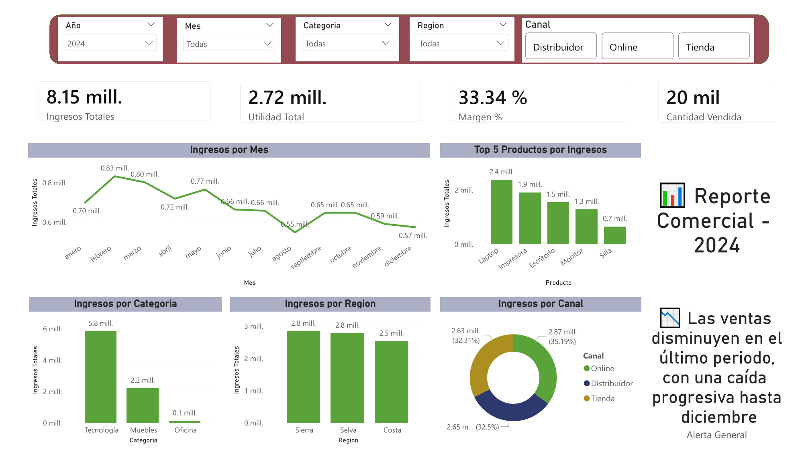
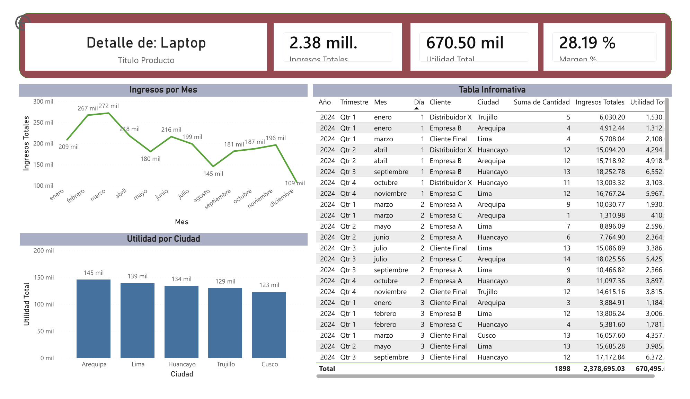

# 📊 Sales & Profitability Analysis — Power BI Dashboard

## 📌 Overview

This project presents an **interactive Power BI dashboard** focused on sales performance and profitability analysis.

It is part of a broader end-to-end analytics workflow:

- SQL → data cleaning and transformation  
- Excel → exploratory analysis and KPI development  
- **Power BI → advanced visualization and business insights**

The goal is to support decision-making through dynamic and interactive analysis.

---

## 🔗 Related Projects

- SQL Data Analysis:  
👉 https://github.com/YERHN28/netlive-sql-ventas-analysis  

- Excel Dashboard Analysis:  
👉 https://github.com/YERHN28/sales-analysis-sql-excel-powerbi  

---

## 🎯 Objective

Analyze sales performance, profitability, and business trends to support strategic decision-making.

---

## 📊 Dashboard Features

- Revenue and profit analysis  
- Performance by product, region, and salesperson  
- Time-based analysis using a calendar table  
- Drill-through functionality for product-level detail  
- Interactive filters for dynamic exploration  

---

## 🧮 Key Metrics (DAX)

The following measures were developed using DAX:

- Total Revenue  
- Total Profit  
- Profit Margin (%)  
- Sales Growth  

---

## 🧮 DAX Measures

Below are some of the key DAX measures used in the dashboard:

```DAX
Total Revenue = SUM(Ventas[Total])

Total Profit = SUM(Ventas[Utilidad])

Profit Margin % = 
DIVIDE([Total Profit], [Total Revenue], 0)

Sales Growth % = 
DIVIDE(
    [Total Revenue] - CALCULATE([Total Revenue], PREVIOUSMONTH(Calendario[Fecha])),
    CALCULATE([Total Revenue], PREVIOUSMONTH(Calendario[Fecha])),
    0
)
```

These measures enable dynamic KPI tracking and time-based performance analysis within the dashboard.

---

## 📸 Dashboard Preview

### 🔹 Executive Summary


### 🔹 Detailed Analysis


### 🔹 Product Detail


---

## 🔍 Key Insights

- Sales show a declining trend in the last quarter, indicating potential seasonal or demand-related factors  
- Laptop is the top-performing product in both revenue and profitability  
- Profitability varies significantly across regions, highlighting opportunities for margin optimization  
- High revenue does not always correlate with high profitability, emphasizing the importance of margin analysis  

---

## 💼 Business Value

This dashboard supports business decision-making by:

- Identifying sales trends and seasonality  
- Highlighting top-performing products and sales segments  
- Detecting profitability gaps across regions  
- Enabling data-driven commercial strategies  

---

## 🛠️ Tools & Technologies

- Power BI  
- DAX  
- Excel (data source)  

---

## 📌 Author

**Yerson Huaman Noriega**  
Aspiring Data Analyst
